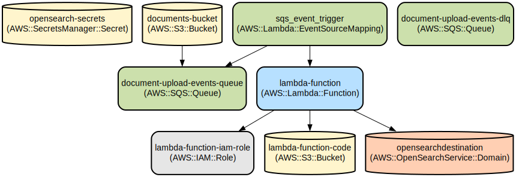

# AWS Document Processing Pipeline with OpenSearch Integration

A serverless document processing pipeline that automatically extracts text from uploaded documents, generates summaries using AWS Bedrock, and indexes the results in Amazon OpenSearch for efficient search and retrieval.

This project provides an end-to-end solution for processing documents uploaded to S3 buckets. When documents are uploaded, they trigger an event-driven workflow that:
- Extracts text content using Amazon Textract for various document formats
- Generates intelligent summaries using AWS Bedrock's Claude language model
- Indexes the summaries and metadata in Amazon OpenSearch for fast searching
- Handles failures gracefully with SQS dead-letter queues and comprehensive logging

The infrastructure is defined as code using Terraform, making it reproducible and maintainable. The solution leverages several AWS services including Lambda, S3, SQS, OpenSearch, and Secrets Manager to create a scalable and secure document processing pipeline.

## Repository Structure
```
.
├── src/                          # Application source code
│   ├── main.py                  # Lambda function for document processing
│   └── requirements.txt         # Python dependencies
└── terraform/                   # Infrastructure as Code
    ├── main.tf                 # Main Terraform configuration
    ├── modules/                # Reusable Terraform modules
    │   ├── iam/               # IAM roles and policies
    │   ├── lambda/            # Lambda function configuration
    │   ├── opensearch/        # OpenSearch domain setup
    │   ├── s3/               # S3 bucket configuration
    │   ├── secrets-manager/   # Secrets management
    │   └── sqs/              # SQS queue configuration
    ├── outputs.tf            # Terraform outputs
    ├── provider.tf           # AWS and Vault provider configuration
    └── variables.tf         # Terraform variables
```

## Usage Instructions
### Prerequisites
- AWS Account with appropriate permissions
- Terraform >= 1.0
- Python 3.12
- HashiCorp Vault (for secrets management)
- AWS CLI configured with appropriate credentials

### Installation

1. Clone the repository:
```bash
git clone <repository-url>
cd <repository-name>
```

2. Install Python dependencies:
```bash
cd src
pip install -r requirements.txt
```

3. Initialize Terraform:
```bash
cd ../terraform
terraform init
```

4. Configure Vault secrets:
Create a secret in Vault at `secret/opensearch` with the following structure:
```json
{
  "username": "your-opensearch-username",
  "password": "your-opensearch-password"
}
```

### Quick Start

1. Deploy the infrastructure:
```bash
terraform plan
terraform apply
```

2. Upload a document to the created S3 bucket:
```bash
aws s3 cp your-document.pdf s3://documents-bucket/
```

3. Monitor the processing:
```bash
aws logs tail /aws/lambda/lambda-function --follow
```

### More Detailed Examples

1. Processing different document types:
```python
# Upload a PDF document
aws s3 cp sample.pdf s3://documents-bucket/

# Upload a text file
aws s3 cp sample.txt s3://documents-bucket/
```

2. Querying OpenSearch for processed documents:
```python
from opensearchpy import OpenSearch
client = OpenSearch(hosts=[{'host': OPENSEARCH_ENDPOINT, 'port': 443}])
response = client.search(
    index="documents",
    body={"query": {"match": {"summary": "your search term"}}}
)
```

### Troubleshooting

Common issues and solutions:

1. Lambda Function Timeouts
- **Problem**: Lambda function execution exceeds timeout
- **Solution**: 
  ```bash
  # Check CloudWatch logs
  aws logs get-log-events --log-group-name /aws/lambda/lambda-function
  ```
  Increase the Lambda timeout in terraform/modules/lambda/main.tf

2. OpenSearch Connection Issues
- **Problem**: Lambda cannot connect to OpenSearch
- **Solution**: Verify security group settings and IAM permissions
  ```bash
  # Test OpenSearch connectivity
  aws opensearch describe-domain --domain-name opensearchdestination
  ```

## Data Flow
The system processes documents through a series of transformations from upload to searchable content.

```ascii
Upload → S3 → SQS → Lambda → Bedrock → OpenSearch
   |        |      |        |          |
   |        |      |        |          └─ Index
   |        |      |        └─ Summarize
   |        |      └─ Buffer
   |        └─ Trigger
   └─ Document
```

Key component interactions:
1. S3 bucket receives document uploads and triggers events
2. SQS queues buffer events and provide retry capability
3. Lambda function processes documents using Textract and Bedrock
4. OpenSearch stores processed results for searching
5. Secrets Manager securely stores OpenSearch credentials

## Infrastructure



### Lambda Functions
- `lambda-function`: Python 3.12 runtime
  - Processes documents from S3
  - Generates summaries using Bedrock
  - Indexes results in OpenSearch

### Storage
- `documents-bucket`: S3 bucket for uploaded documents
- `lambda-function-code`: S3 bucket for Lambda deployment packages

### Queues
- `document-upload-events-queue`: Main SQS queue
- `document-upload-events-dlq`: Dead-letter queue

### Search
- `opensearchdestination`: OpenSearch domain
  - Engine version: OpenSearch 2.17
  - Instance type: t3.small.search
  - EBS storage: 10GB

### Security
- IAM roles and policies for Lambda execution
- Secrets Manager for OpenSearch credentials
- Encrypted data at rest and in transit